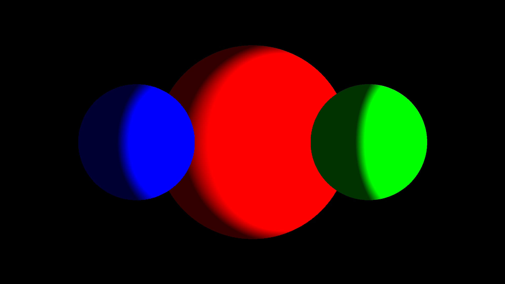

# Raytracer

A Python-based raytracer. This project implements basic raytracing techniques to render 3D scenes with realistic lighting. Work in progress...

## ✨ Features

- **Diffuse Lighting** — Realistic light scattering on surfaces
- **Point Light Sources** — Multiple light sources support
- **Sphere Primitives** — Basic 3D sphere objects
- **Customizable Scenes** — Easy scene configuration with objects and lights
- **High-Quality Output** — Renders to PNG images

## 🛠️ Project Structure

```
raytracer/
├── src/
│   └── raytracer/
│       ├── main.py           # Entry point
│       ├── Camera.py          # Camera implementation
│       ├── Ray.py             # Ray class
│       ├── Color.py           # Color handling
│       ├── Scene.py           # Scene management
│       ├── Render.py          # Rendering engine
│       └── objects/
│           ├── Sphere.py      # Sphere primitive
│           ├── RenderObject.py # Base object class
│           └── lights/
│               ├── Light.py        # Light base class
│               └── PointLight.py   # Point light source
├── requirements.txt       # Python dependencies
├── pyproject.toml        # Project configuration
├── LICENSE               # MIT License
└── README.md            # This file
```

## 🎯 Roadmap

- [x] Diffuse lighting
- [x] Point light sources
- [x] Sphere primitives
- [ ] Reflections and refractions
- [ ] Different materials (matte, glossy, metallic)
- [ ] Ambient Occlusion
- [ ] Shadow rays
- [ ] Anti-aliasing
- [ ] Multiple primitive types (planes, triangles)
- [ ] Load models from file
- [ ] Multi-threading support
- [ ] Progress bar for rendering

## 🧪 Development

### Code Style

This project uses [Ruff](https://github.com/astral-sh/ruff) for linting and formatting

## 📝 License

This project is licensed under the MIT License - see the [LICENSE](LICENSE) file for details.

## 👤 Author

**Gleb Orlovskiy**
